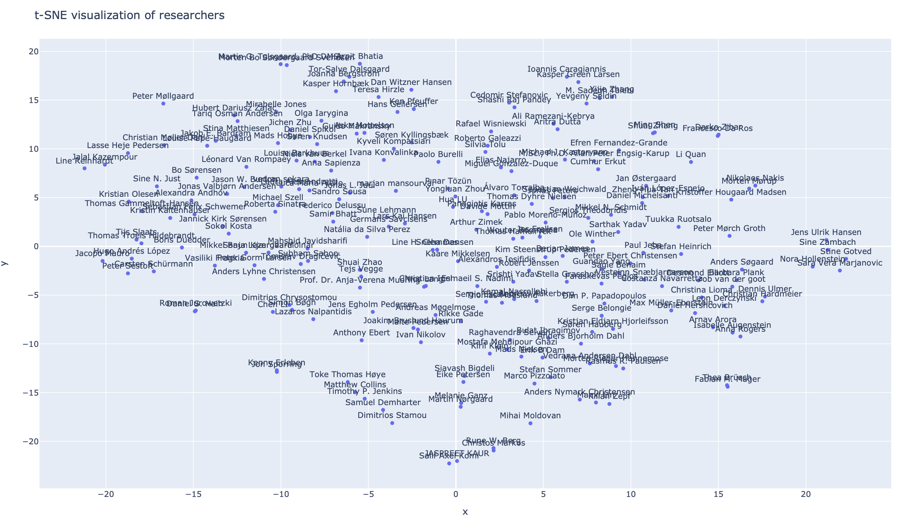

# Visualizing P1 researchers using TF-IDF and t-SNE

*gather_profiles*: Researcher data (`data/extended_data.yml`) is exported from Google Scholar and includes title, abstract, journal and author information for both the five most cited and five most recent publications.

*gather_keywords*: The scholar data is organised into a set of stems/keywords with nltk, giving a per-researcher vector for comparison / analysis (`data/member_keywords.yml`).

*extended_tsne_analyzer.py*: Low-dimensional representation of researcher keywords, generating an image like the one above.
